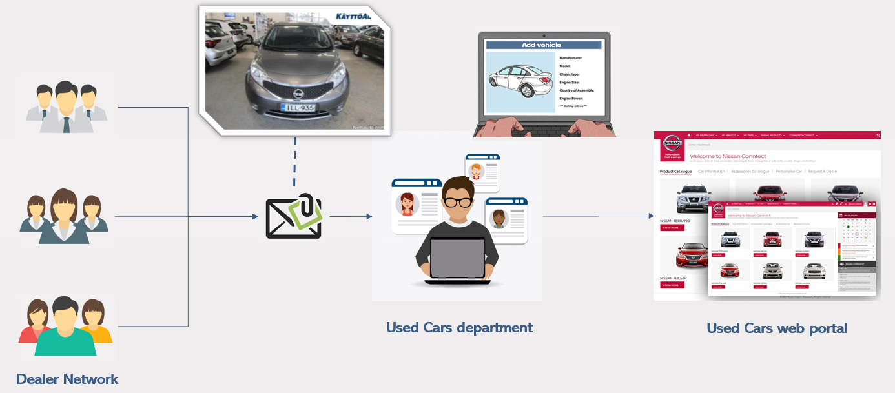
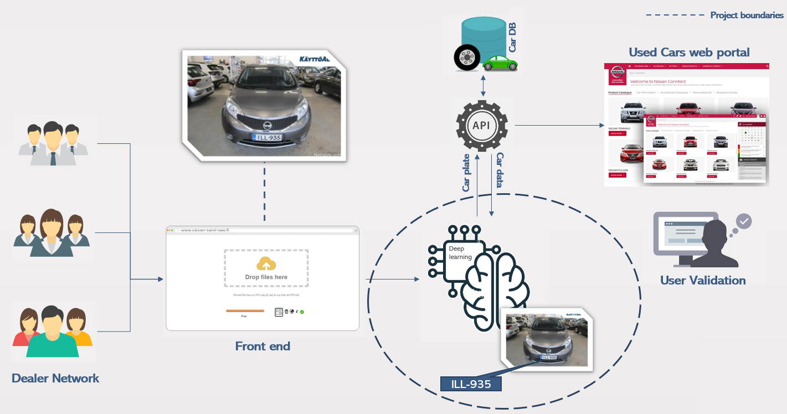
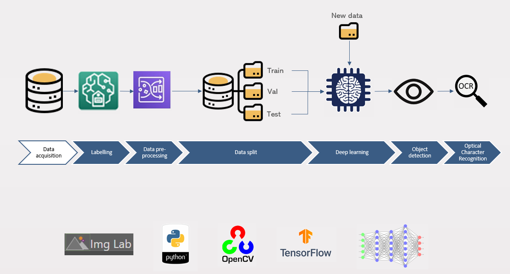

# Analytical Service Development

### The problem

**Used cars – The hidden business of an automotive brand**: During the last 10 years working in the automotive industry, I’ve discovered that one of the key business for an automotive brand is, on top of manufacture and sell new vehicles, to resell used vehicles in the secondhand market.

In Nissan concretely, thousands of vehicles returned from fleets, company cars or leased cars are sold in the secondhand market every year and, in order to make these cars visible for the customers, a huge number of advertisements are published daily.

In the case of Nissan Nordic, our team in the Used Cars department receive from our Nissan dealers in Finland, the information of the cars (model, mileage, year, etc.) and the pictures of those cars that need to be published.

All these pictures are filtered and published in our corporate website and all the information about the car is manually typed which is, of course,  not a very efficient process.

**The objective of this project is to carry out a license plate recognition system to get the car data with as less human intervention as possible.**

### Dataset and high level procedure

We got a dataset of 300 car images from our customer which has been used to train the model.

The first step has been to label every single image, highlighting the region of the picture where the car plate is located. To do this we have used [ImgLab] (https://imglab.in/#) which is a platform independent data annoation tool that runs directly from the browser, and has no prerequisites. It requires minimal CPU and memory and supports multiple formats such as dlib XML, dlib pts, Pascal VOC, COCO and Tensorflow.

Once we labeled all the images, we applied some preprocessing (resizing of images and annotations) and we split our data into train, validation and test sets to train and evaluate the performance of our model.

Finally, we use the predicited area given by our model to crop the images and center the car plate. With the obtained subset we apply some image processing tecniques (blur, grayscale, contours, etc) to identify the exact area of the plate and finally usign OCR we

### Steps

<ol type="1">
    <li>Import required libraries and define main varaibles</li>
    <li>Read and resize images and save them into an array (X)</li>
    <li>Parsing data from XML annotations, resize them to fit the new image sizes and save them into y</li>
    <li>Verfy X and y shapes and print the first 20 images from the dataset</li>
    <li>Convolutional Neural Network (CNN)</li>
    <li>Training the model</li>
    <li>Evaluating the model</li>
    <li>Plotting results</li>
</ol>

### Model Architecture

<ol type="1">
    <li>Embedding Layer</li>
    <li>LSTM Layer</li>
    <li>Dense (activation function using sigmoid)</li>
    <li>Optimizer: Rmsprop, Loss Function: Binary Crossentropy</li>
</ol>

### As IS

### To BE

### Analytics process

### References

<li><a href=https://medium.com/geekculture/10-hyperparameters-to-keep-an-eye-on-for-your-lstm-model-and-other-tips-f0ff5b63fcd4>
    https://medium.com/geekculture/10-hyperparameters-to-keep-an-eye-on-for-your-lstm-model-and-other-tips-f0ff5b63fcd4
</li>
